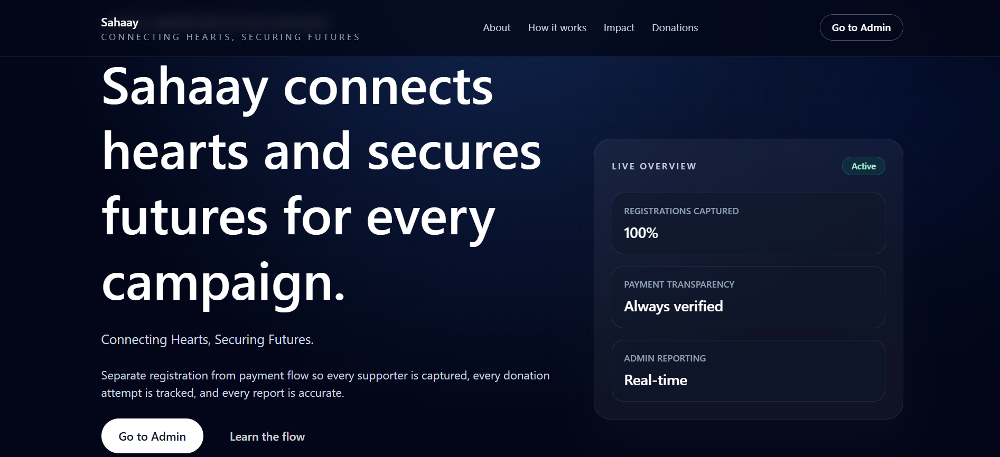
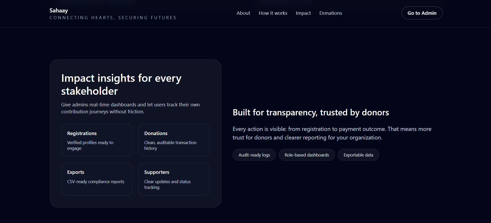
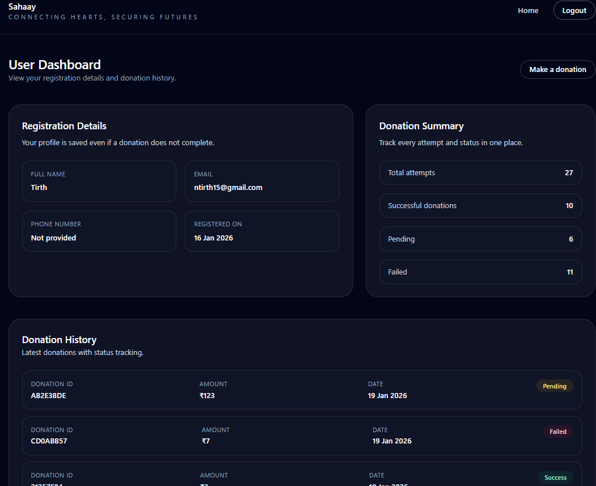
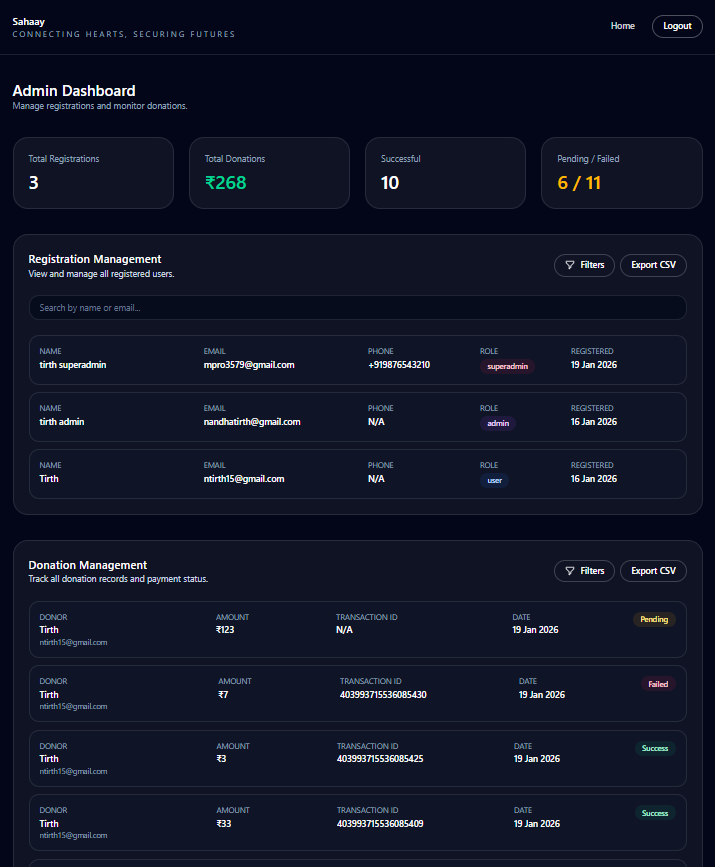

# Sahaay - NGO Registration and Donation Management System

A secure, full-stack web application that separates user registration from donation flow, ensuring data integrity, transparency, and ethical handling of payments for NGO campaigns.

---

## 📋 Table of Contents

- [Overview](#-overview)
- [Features](#-features)
- [Tech Stack](#-tech-stack)
- [Architecture](#-architecture)
- [Database Schema](#-database-schema)
- [Installation & Setup](#-installation--setup)
- [Environment Variables](#-environment-variables)
- [Project Structure](#-project-structure)
- [Application Flow](#-application-flow)
- [API Endpoints](#-api-endpoints)
- [Authentication & Authorization](#-authentication--authorization)
- [Payment Integration](#-payment-integration)
- [Test Credentials](#-test-credentials)
- [Development](#-development)
- [Screenshots](#-screenshots)

---

## 🎯 Overview

**Sahaay** addresses a critical issue in NGO online campaigns: user data loss when donations aren't completed. This system ensures:

- ✅ User registration is **independent** of donation completion
- ✅ All user data is **preserved** regardless of payment outcome
- ✅ Payment status is tracked accurately (success, pending, failed)
- ✅ Administrators have full visibility into registrations and donations
- ✅ Secure, role-based access control (User, Admin, Super Admin)

---

## ✨ Features

### 👤 User Features
- **Secure Authentication**: Login/signup with email and password
- **Profile Management**: View registration details (name, email, phone, registration date)
- **Donation System**: Make donations of any amount via PayU payment gateway
- **Donation History**: Track all donation attempts with status and timestamps
- **Payment Status Notifications**: Real-time feedback on payment success/failure

### 🛡️ Admin Features
- **Dashboard Analytics**: View total registrations and donations received
- **Registration Management**: View all users, search, filter by role, export to CSV
- **Donation Management**: View all donations, track payment status, filter by status
- **Export Data**: Download registration and donation data as CSV files

### 🔐 Super Admin Features
- **User Role Management**: Promote users to admin or demote admins to users
- **Protected Actions**: Superadmins cannot be modified by other superadmins
- **Full System Visibility**: Access to all user and admin data

### 🔒 Security Features
- Row Level Security (RLS) policies in Supabase
- Secure session management with HTTP-only cookies
- Payment hash verification for transaction integrity
- Role-based route protection via **Middleware**

---

## 🛠️ Tech Stack

### Frontend
- **Framework**: [Next.js 16.1.1](https://nextjs.org/) (App Router with Turbopack)
- **UI Framework**: [React 19.2.3](https://react.dev/)
- **Styling**: [Tailwind CSS 4](https://tailwindcss.com/)
- **Language**: [TypeScript 5](https://www.typescriptlang.org/)

### Backend & Database
- **Database**: [Supabase](https://supabase.com/) (PostgreSQL)
- **Authentication**: Supabase Auth
- **ORM**: Supabase Client (with SSR support)
- **Payment Gateway**: [PayU](https://payu.in/) (Test/Sandbox mode)

### Key Libraries
- `@supabase/supabase-js` (v2.90.1) - Database client
- `@supabase/ssr` (v0.8.0) - Server-Side Rendering support
- `crypto` (Node.js) - Hash generation for payment security

---

## 📦 Architecture

### Client vs Server Components

This application uses Next.js **App Router** with a hybrid rendering strategy:

#### ⚙️ Server Components (Default)
Used for secure data fetching and SEO optimization:

- **`app/page.tsx`** - Landing page (checks auth status server-side)
- **`app/dashboard/page.tsx`** - User dashboard (fetches user data)
- **`app/admin/page.tsx`** - Admin dashboard (fetches all users/donations)
- **`app/superadmin/page.tsx`** - Super admin dashboard
- **`app/auth/page.tsx`** - Authentication page wrapper

**Why Server Components?**
- Secure database queries (no API exposure)
- Reduced client-side JavaScript
- Better SEO and initial page load performance
- Direct access to environment variables

#### 🖥️ Client Components (`'use client'`)
Used for interactivity and real-time updates:

- **`app/auth/AuthForm.tsx`** - Login/Signup form (handles user input)
- **`app/donate/page.tsx`** - Donation form (interactive payment flow)
- **`components/admin/RegistrationManagementClient.tsx`** - Client-side filtering/search
- **`components/admin/DonationManagementClient.tsx`** - Client-side filtering
- **`components/superadmin/UserManagementClient.tsx`** - Role management UI
- **`components/LogoutButton.tsx`** - Handles logout action

**Why Client Components?**
- Form state management (`useState`, `useEffect`)
- User interactions (search, filters, modals)
- Real-time UI updates
- Browser APIs (localStorage, window)

### Request Handling Flow

```
┌─────────────────┐
│  Client Request │
└────────┬────────┘
         │
         ▼
┌─────────────────┐
│   Middleware    │ ◄── Session validation, role-based redirects
│ (middleware.ts) │
└────────┬────────┘
         │
         ▼
┌─────────────────┐
│  Page Component │ ◄── Server Component: Fetch data from Supabase
│  (Server Side)  │
└────────┬────────┘
         │
         ▼
┌─────────────────┐
│ Client Component│ ◄── Hydrates with data, handles user interactions
│ (If needed)     │
└─────────────────┘
```

---

## 🗄️ Database Schema

### Tables

#### 1. `profiles` (User Profiles)
Extends Supabase's `auth.users` with custom fields.

```sql
CREATE TABLE profiles (
  id UUID PRIMARY KEY REFERENCES auth.users(id),
  name TEXT,
  email TEXT,
  phone_number TEXT,
  role TEXT NOT NULL DEFAULT 'user' CHECK (role IN ('user', 'admin', 'superadmin')),
  created_at TIMESTAMPTZ DEFAULT CURRENT_TIMESTAMP
);
```

**Columns:**
- `id`: User ID (foreign key to `auth.users`)
- `name`: User's full name
- `email`: User's email (synced from auth.users)
- `phone_number`: User's phone in format `+911234567890`
- `role`: User role (`user`, `admin`, `superadmin`)
- `created_at`: Registration timestamp

#### 2. `donations` (Donation Records)
Tracks all donation attempts and their status.

```sql
CREATE TABLE donations (
  id UUID PRIMARY KEY DEFAULT uuid_generate_v4(),
  user_id UUID NOT NULL REFERENCES profiles(id),
  amount NUMERIC NOT NULL,
  status TEXT NOT NULL DEFAULT 'pending' CHECK (status IN ('pending', 'success', 'failed')),
  timestamp TIMESTAMPTZ NOT NULL DEFAULT NOW(),
  transaction_id TEXT
);
```

**Columns:**
- `id`: Unique donation ID
- `user_id`: Foreign key to `profiles.id`
- `amount`: Donation amount in INR
- `status`: Payment status (`pending`, `success`, `failed`)
- `timestamp`: Donation attempt timestamp
- `transaction_id`: PayU's `mihpayid` (stored after payment)

### Row Level Security (RLS) Policies

#### Profiles Table
```sql
-- Users can view their own profile
CREATE POLICY "Users can view own profile"
ON profiles FOR SELECT TO authenticated
USING (auth.uid() = id);

-- Admins and superadmins can view all profiles
CREATE POLICY "Admins can view all profiles"
ON profiles FOR SELECT TO authenticated
USING (
  EXISTS (
    SELECT 1 FROM profiles
    WHERE id = auth.uid() AND role IN ('admin', 'superadmin')
  )
);
```

#### Donations Table
```sql
-- Users can view their own donations
CREATE POLICY "Users can view own donations"
ON donations FOR SELECT TO authenticated
USING (user_id = auth.uid());

-- Admins can view all donations
CREATE POLICY "Admins can view all donations"
ON donations FOR SELECT TO authenticated
USING (
  EXISTS (
    SELECT 1 FROM profiles
    WHERE id = auth.uid() AND role IN ('admin', 'superadmin')
  )
);
```

### Indexes
```sql
-- Performance optimization for role-based queries
CREATE INDEX idx_profiles_role ON profiles(role);

-- Optimize donation queries by user
CREATE INDEX idx_donations_user_id ON donations(user_id);

-- Optimize donation queries by status
CREATE INDEX idx_donations_status ON donations(status);
```

---

## 📦 Installation & Setup

### Prerequisites
- **Node.js** 18+ and npm/pnpm
- **Supabase Account** (free tier works)
- **PayU Merchant Account** (Test/Sandbox credentials)

### Step 1: Clone the Repository
```bash
git clone https://github.com/TirthNandha/NGO-Registrarion-and-Donation-Mgmt-Sys.git
```

### Step 2: Install Dependencies
```bash
npm install
```

### Step 3: Set Up Supabase

1. Create a new project at [supabase.com](https://supabase.com)
2. Go to **SQL Editor** and run the following:

```sql
-- Enable UUID extension
CREATE EXTENSION IF NOT EXISTS "uuid-ossp";

-- Create profiles table
CREATE TABLE profiles (
  id UUID PRIMARY KEY REFERENCES auth.users(id) ON DELETE CASCADE,
  name TEXT,
  email TEXT,
  phone_number TEXT,
  role TEXT NOT NULL DEFAULT 'user' CHECK (role IN ('user', 'admin', 'superadmin')),
  created_at TIMESTAMPTZ DEFAULT CURRENT_TIMESTAMP
);

-- Create donations table
CREATE TABLE donations (
  id UUID PRIMARY KEY DEFAULT uuid_generate_v4(),
  user_id UUID NOT NULL REFERENCES profiles(id) ON DELETE CASCADE,
  amount NUMERIC NOT NULL,
  status TEXT NOT NULL DEFAULT 'pending' CHECK (status IN ('pending', 'success', 'failed')),
  timestamp TIMESTAMPTZ NOT NULL DEFAULT NOW(),
  transaction_id TEXT
);

-- Create indexes
CREATE INDEX idx_profiles_role ON profiles(role);
CREATE INDEX idx_donations_user_id ON donations(user_id);
CREATE INDEX idx_donations_status ON donations(status);

-- Enable RLS
ALTER TABLE profiles ENABLE ROW LEVEL SECURITY;
ALTER TABLE donations ENABLE ROW LEVEL SECURITY;

-- RLS Policies for profiles
CREATE POLICY "Users can view own profile"
ON profiles FOR SELECT TO authenticated
USING (auth.uid() = id);

CREATE POLICY "Users can insert own profile"
ON profiles FOR INSERT TO authenticated
WITH CHECK (auth.uid() = id);

CREATE POLICY "Users can update own profile"
ON profiles FOR UPDATE TO authenticated
USING (auth.uid() = id);

CREATE POLICY "Admins can view all profiles"
ON profiles FOR SELECT TO authenticated
USING (
  EXISTS (
    SELECT 1 FROM profiles
    WHERE id = auth.uid() AND role IN ('admin', 'superadmin')
  )
);

-- RLS Policies for donations
CREATE POLICY "Users can view own donations"
ON donations FOR SELECT TO authenticated
USING (user_id = auth.uid());

CREATE POLICY "Users can insert own donations"
ON donations FOR INSERT TO authenticated
WITH CHECK (user_id = auth.uid());

CREATE POLICY "Admins can view all donations"
ON donations FOR SELECT TO authenticated
USING (
  EXISTS (
    SELECT 1 FROM profiles
    WHERE id = auth.uid() AND role IN ('admin', 'superadmin')
  )
);

CREATE POLICY "System can update donations"
ON donations FOR UPDATE TO authenticated
USING (true);

-- Create trigger to auto-populate profiles on signup
CREATE OR REPLACE FUNCTION public.handle_new_user()
RETURNS TRIGGER AS $$
BEGIN
  INSERT INTO public.profiles (id, name, email, role)
  VALUES (
    NEW.id,
    COALESCE(NEW.raw_user_meta_data->>'name', 'User'),
    NEW.email,
    'user'
  )
  ON CONFLICT (id) 
  DO UPDATE SET 
    email = NEW.email,
    name = COALESCE(profiles.name, NEW.raw_user_meta_data->>'name', 'User');
  RETURN NEW;
END;
$$ LANGUAGE plpgsql SECURITY DEFINER;

DROP TRIGGER IF EXISTS on_auth_user_created ON auth.users;

CREATE TRIGGER on_auth_user_created
  AFTER INSERT OR UPDATE ON auth.users
  FOR EACH ROW 
  EXECUTE FUNCTION public.handle_new_user();
```

3. **Create your first admin** (run in SQL Editor):
```sql
-- Replace with your email after signing up
UPDATE profiles 
SET role = 'admin' 
WHERE email = 'your-email@example.com';
```

4. **Create superadmin** (optional):
```sql
UPDATE profiles 
SET role = 'superadmin' 
WHERE email = 'superadmin-email@example.com';
```

### Step 4: Configure Environment Variables

Create a `.env.local` file in the project root:

```env
# Supabase Configuration
NEXT_PUBLIC_SUPABASE_URL=https://your-project.supabase.co
NEXT_PUBLIC_SUPABASE_ANON_KEY=your-anon-key
SUPABASE_SERVICE_KEY=your-service-role-key

# PayU Configuration (Test Mode)
PAYU_MERCHANT_KEY=your-test-merchant-key
PAYU_MERCHANT_SALT=your-test-merchant-salt
PAYU_ENV=test

# Site URL
NEXT_PUBLIC_SITE_URL=http://localhost:3000
```

**Finding Supabase Keys:**
1. Go to Supabase Dashboard → Project Settings → API
2. Copy `URL` → `NEXT_PUBLIC_SUPABASE_URL`
3. Copy `anon/public` key → `NEXT_PUBLIC_SUPABASE_ANON_KEY`
4. Copy `service_role` key → `SUPABASE_SERVICE_KEY` ⚠️ Keep this secret!

**Getting PayU Test Credentials:**
1. Sign up at [PayU Developer Portal](https://onboarding.payu.in/app/account/signin)
2. Get test merchant credentials from the dashboard

### Step 5: Run the Development Server

```bash
npm run dev
```

Open [http://localhost:3000](http://localhost:3000) in your browser.

---

## 🌐 Environment Variables

| Variable | Description | Required | Example |
|----------|-------------|----------|---------|
| `NEXT_PUBLIC_SUPABASE_URL` | Supabase project URL | ✅ Yes | `https://xxx.supabase.co` |
| `NEXT_PUBLIC_SUPABASE_ANON_KEY` | Supabase anon/public key | ✅ Yes | `eyJhbGc...` |
| `SUPABASE_SERVICE_KEY` | Supabase service role key (server-only) | ✅ Yes | `eyJhbGc...` |
| `PAYU_MERCHANT_KEY` | PayU merchant key | ✅ Yes | `your-key` |
| `PAYU_MERCHANT_SALT` | PayU merchant salt | ✅ Yes | `your-salt` |
| `PAYU_ENV` | PayU environment (test/production) | ✅ Yes | `test` |
| `NEXT_PUBLIC_SITE_URL` | Your application URL | ✅ Yes | `http://localhost:3000` |

---

## 📁 Project Structure

```
ngo-system/
├── app/                          # Next.js App Router
│   ├── page.tsx                  # Landing page (Server Component)
│   ├── layout.tsx                # Root layout
│   ├── globals.css               # Global styles
│   ├── auth/
│   │   ├── page.tsx             # Auth wrapper (Server)
│   │   └── AuthForm.tsx         # Login/Signup form (Client)
│   ├── dashboard/
│   │   └── page.tsx             # User dashboard (Server)
│   ├── admin/
│   │   └── page.tsx             # Admin dashboard (Server)
│   ├── superadmin/
│   │   └── page.tsx             # Super admin dashboard (Server)
│   ├── donate/
│   │   └── page.tsx             # Donation page (Client)
│   └── api/
│       ├── payu-initiate/
│       │   └── route.ts         # PayU payment initiation
│       ├── payment-callback/
│       │   └── route.ts         # PayU callback handler
│       └── update-user-role/
│           └── route.ts         # Super admin role management
│
├── components/
│   ├── ui/                       # Reusable UI components
│   │   ├── Button.tsx
│   │   ├── Badge.tsx
│   │   └── Container.tsx
│   ├── layout/                   # Layout components
│   │   ├── Navbar.tsx
│   │   ├── Footer.tsx
│   │   └── AppHeader.tsx
│   ├── home/
│   │   └── FeatureCard.tsx
│   ├── dashboard/               # User dashboard components
│   │   ├── UserProfileCard.tsx
│   │   ├── DonationSummaryCard.tsx
│   │   ├── DonationHistoryTable.tsx
│   │   └── PaymentNotification.tsx
│   ├── admin/                   # Admin dashboard components
│   │   ├── StatsOverview.tsx
│   │   ├── RegistrationManagementClient.tsx
│   │   └── DonationManagementClient.tsx
│   ├── superadmin/              # Super admin components
│   │   ├── UserManagementClient.tsx
│   │   └── RoleChangeModal.tsx
│   └── LogoutButton.tsx
│
├── lib/
│   ├── supabase/                # Supabase client utilities
│   │   ├── client.ts            # Browser client
│   │   ├── server.ts            # Server client
│   │   └── middleware.ts        # Session management
│   ├── types/
│   │   └── index.ts             # TypeScript type definitions
│   ├── hooks/                   # Custom React hooks
│   │   ├── useAdminData.ts
│   │   ├── useSuperAdminData.ts
│   │   ├── useUserDashboard.ts
│   │   ├── useRegistrationFilters.ts
│   │   └── useDonationFilters.ts
│   └── utils/
│       └── csvExport.ts         # CSV export utility
│
├── middleware.ts                # Next.js middleware
├── .env.local                   # Environment variables (create this)
├── package.json
├── tsconfig.json
├── tailwind.config.ts
└── README.md
```

---

## 🔄 Application Flow

For application flow, please refer to the diagrams in the [diagrams](./public/images/diagrams) folder.

---

## 🔌 API Endpoints

### 1. `POST /api/payu-initiate`

Initiates a PayU payment by generating necessary parameters and hash.

**Request Body:**
```json
{
  "amount": 100,
  "donationId": "uuid-here",
  "firstname": "John Doe",
  "email": "john@example.com",
  "phone": "+919876543210"
}
```

**Response:**
```json
{
  "payuUrl": "https://test.payu.in/_payment",
  "payuParams": {
    "key": "merchant-key",
    "hash": "calculated-sha512-hash",
    "txnid": "TXN_1234567890_123",
    "amount": "100.00",
    "productinfo": "Donation_uuid",
    "firstname": "John Doe",
    "email": "john@example.com",
    "phone": "+919876543210",
    "surl": "http://localhost:3000/api/payment-callback",
    "furl": "http://localhost:3000/api/payment-callback",
    "udf1": "uuid-here"
  }
}
```

**Security:** Generates SHA-512 hash using formula:
```
sha512(key|txnid|amount|productinfo|firstname|email|udf1|udf2|udf3|udf4|udf5||||||salt)
```

---

### 2. `POST /api/payment-callback`

Handles PayU payment callbacks (success/failure).

**Request:** PayU sends form data (application/x-www-form-urlencoded)

**Key Fields:**
- `status`: "success" | "failure" | "pending"
- `mihpayid`: PayU's transaction ID (stored in DB)
- `hash`: Verification hash
- `udf1`: Our donation ID

**Process:**
1. Verify hash from PayU
2. Update donation status in database
3. Store PayU's `mihpayid` as `transaction_id`
4. Redirect to `/dashboard?payment=success/failed`

**Response:** HTTP 302 redirect to dashboard

---

### 3. `GET /api/payment-callback`

Handles payment cancellations (when user clicks "Cancel" on PayU page).

**Query Params:**
- `donationId`: UUID of the donation
- `txnid`: Transaction ID (optional)

**Process:**
1. Mark donation as `failed` in database
2. Redirect to `/dashboard?payment=failed`

---

### 4. `POST /api/update-user-role`

Allows superadmins to change user roles.

**Request Body:**
```json
{
  "userId": "user-uuid",
  "newRole": "admin" // or "user"
}
```

**Response:**
```json
{
  "success": true,
  "message": "User role updated to admin",
  "user": {
    "id": "uuid",
    "name": "John Doe",
    "email": "john@example.com",
    "oldRole": "user",
    "newRole": "admin"
  }
}
```

**Security Checks:**
- ✅ Requires authenticated superadmin
- ✅ Cannot change own role
- ✅ Cannot change other superadmin roles
- ✅ Only allows 'user' and 'admin' as target roles

---

## 🔐 Authentication & Authorization

### Authentication Flow

**Supabase Auth** handles user authentication with email/password.

#### Client-Side (Browser)
```typescript
// lib/supabase/client.ts
import { createBrowserClient } from '@supabase/ssr';

export function createClient() {
  return createBrowserClient(
    process.env.NEXT_PUBLIC_SUPABASE_URL!,
    process.env.NEXT_PUBLIC_SUPABASE_ANON_KEY!
  );
}
```

#### Server-Side (Next.js Server Components)
```typescript
// lib/supabase/server.ts
import { createServerClient } from '@supabase/ssr';
import { cookies } from 'next/headers';

export async function createClient() {
  const cookieStore = await cookies();
  return createServerClient(
    process.env.NEXT_PUBLIC_SUPABASE_URL!,
    process.env.NEXT_PUBLIC_SUPABASE_ANON_KEY!,
    {
      cookies: {
        getAll() { return cookieStore.getAll(); },
        setAll(cookiesToSet) {
          cookiesToSet.forEach(({ name, value, options }) =>
            cookieStore.set(name, value, options)
          );
        },
      },
    }
  );
}
```

### Authorization (Middleware)

**`middleware.ts`** protects routes and handles role-based redirects:

```typescript
export async function middleware(request: NextRequest) {
  // 1. Update session
  // 2. Check if route is protected
  // 3. Verify user authentication
  // 4. Check user role from profiles table
  // 5. Redirect based on role:
  //    - user → /dashboard
  //    - admin → /admin (can also access /dashboard)
  //    - superadmin → /superadmin (can access all)
}
```

**Protected Routes:**
- `/dashboard` - Requires `user` role
- `/admin` - Requires `admin` or `superadmin` role
- `/superadmin` - Requires `superadmin` role only
- `/donate` - Requires authentication

**Public Routes:**
- `/` (Landing page)
- `/auth` (Login/Signup)

---

## 💳 Payment Integration

### PayU Test Mode Setup

This application uses **PayU Payment Gateway** in **Test/Sandbox mode**.

#### Test Cards (for testing)

| Card Number | CVV | Expiry | OTP | Result |
|-------------|-----|--------|-----|--------|
| 5123456789012346 | 123 | 05/30 | 123456 | ✅ Success |

#### Payment Flow Details

1. **Initiation**: 
   - User submits donation form
   - System creates donation record (status: `pending`)
   - Calls `/api/payu-initiate` to generate hash
   - Redirects user to PayU payment page

2. **Hash Calculation**:
   ```
   Request Hash = SHA512(key|txnid|amount|productinfo|firstname|email|udf1|udf2|udf3|udf4|udf5||||||salt)
   Response Hash = SHA512(salt|status||||||udf5|udf4|udf3|udf2|udf1|email|firstname|productinfo|amount|txnid|key)
   ```

3. **Callback Handling**:
   - PayU sends POST request to `/api/payment-callback`
   - System verifies response hash
   - Updates donation status in database
   - Stores PayU's `mihpayid` as `transaction_id`
   - Redirects to dashboard with status message

4. **Cancellation Handling**:
   - If user clicks "Cancel" on PayU page
   - PayU sends GET request to callback URL
   - System marks donation as `failed`
   - Redirects to dashboard with failure message

### Important Notes

- ⚠️ **Test Mode Only**: This uses PayU sandbox environment
- ⚠️ **No Real Money**: No actual transactions occur
- ⚠️ **Production**: Replace `PAYU_ENV=test` with `production` and use live credentials

---

## 🧪 Test Credentials

You can use the following test accounts to explore different features of the application:

### 👤 User Account
- **Email**: `ntirth15@gmail.com`
- **Password**: `123456`
- **Access**: User dashboard, donation functionality

### 🛡️ Admin Account
- **Email**: `nandhatirth@gmail.com`
- **Password**: `123456`
- **Access**: Admin dashboard, user management, donation management, export features

### 🔐 Super Admin Account
- **Email**: `mpro3579@gmail.com`
- **Password**: `123456`
- **Access**: Full system access, user role management, all admin features

> **Note**: These credentials are for testing purposes only. In a production environment, use strong, unique passwords and enable additional security measures.

---

## 🚀 Development

### Running Locally

```bash
# Install dependencies
npm install

# Run development server
npm run dev

# Build for production
npm run build

# Start production server
npm start

# Run linter
npm run lint
```

### Key Development Commands

```bash
# Clear Next.js cache (if errors occur)
rm -rf .next

# Reset database (Supabase SQL Editor)
DROP TABLE IF EXISTS donations CASCADE;
DROP TABLE IF EXISTS profiles CASCADE;
# Then run setup SQL again
```

### Environment-Specific Behavior

- **Development** (`npm run dev`): Hot reload, detailed error messages
- **Production** (`npm run build && npm start`): Optimized build, error boundaries

---

## 📸 Screenshots

### Landing Page




### User Dashboard


### Admin Dashboard


### Super Admin Dashboard


<div align="center">
Made with ❤️ by <a href="https://www.linkedin.com/in/tirthnandha/" target="_blank">Tirth Nandha</a>
</div>